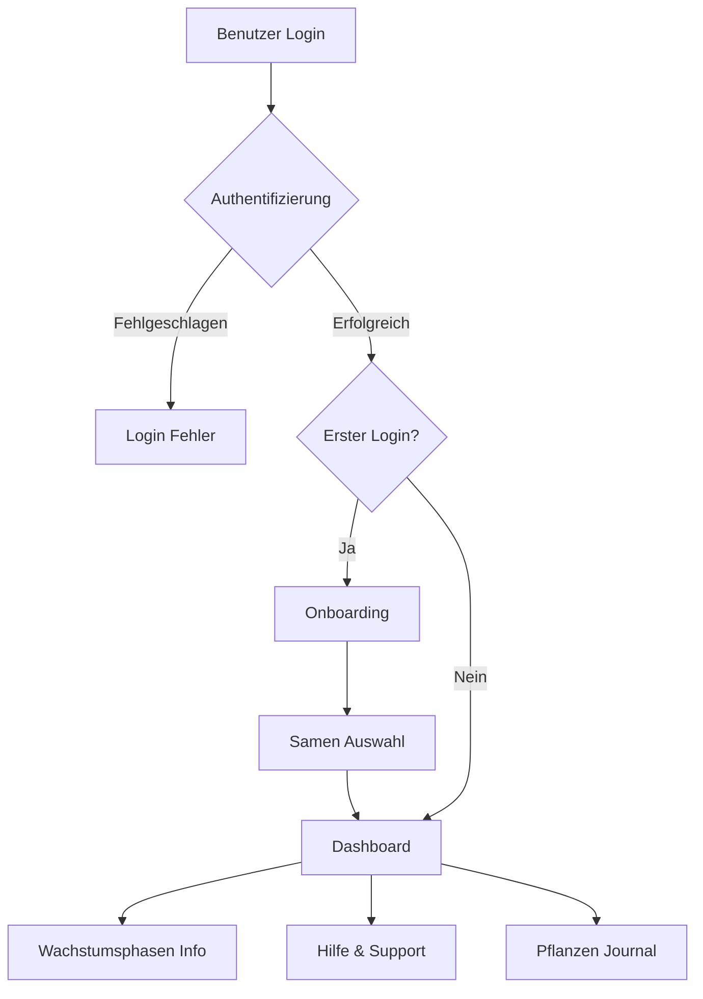
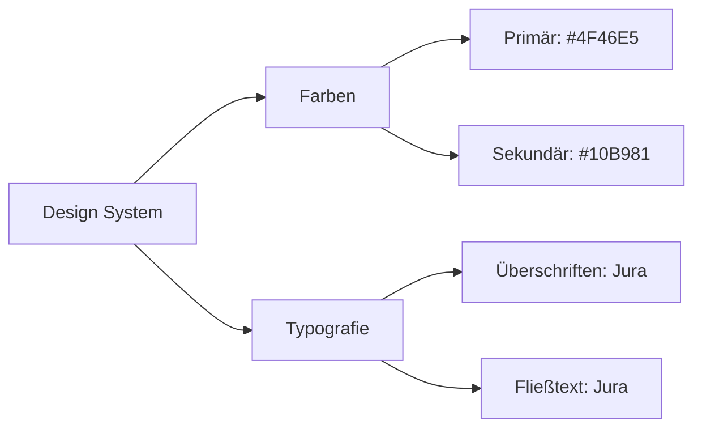

# GrowGuide / Handout Projekt Übersicht

## Link zur Beta- / Ansichtsversion: 

https://www.drc420.team

Hier können Sie die App live anschauen. 
Bitte nutzt aktuell den fest hinterlegten Nutzer **'workshop'** und das Passwort **'drc'**.

## 🎯 Projekt Vision
Das GrowGuide-Projekt ist eine moderne Webanwendung, deren Anwender sowohl wir selbst als auch Kunden unserer Grow-Workshops sind. Zum Einen wird die Anwendung verwendet um wichtige Parameter, die bei den Workshops erwähnt werden, schnell und einfach wieder ins Gedächtnis zu rufen. Sie dient als digitales Handout, mit dem unsere Kunden auf das, was sie bei uns gelernt haben zurückgreifen können, bei Problemen mit uns in Kontakt treten können und zusätzlich personalisierten Zugang zu einem interaktiven Journaling-Werkzeug erhalten, mit dem sie ihren Grow dokumentieren können.

Zum Anderen verwenden *wir* die Anwendung um die Kundenzugänge und angebotenen Samen zu verwalten.

## 🔄 Hauptarbeitsablauf



Das obige Diagramm zeigt den Kernprozess der Benutzerführung durch unsere Anwendung. Jedes Kästchen stellt einen wichtigen Interaktionspunkt dar, und die Pfeile zeigen die möglichen Wege, die Benutzer nehmen können.

## 🌟 Hauptfunktionen
- Digitales Handout zu unseren Workshops
- Personalisiertes Pflanzenjournaling
- Erste Hilfe und Kontakt


## 💡 Design-Entscheidungen & Diskussionspunkte

### Visuelles Design


### Technischer Stack

- Entwickelt mit Next.js
- Tailwind CSS für das Styling
- SQLite Datenbank

Die Anwendung ist eine moderne Javascript-App, die auf einem webserver gehostet werden muss, der node.js unterstützt. Node.js ist eine kostenfreie, plattformübergreifende Open-Source-JavaScript-Laufzeitumgebung, die JavaScript-Code außerhalb eines Webbrowsers ausführen kann.


## 🛠️ Entwicklungsumgebung

```bash
npm install
npm run dev
```

Öffnen Sie [http://localhost:3000]in Ihrem Browser, um das Ergebnis zu sehen.
