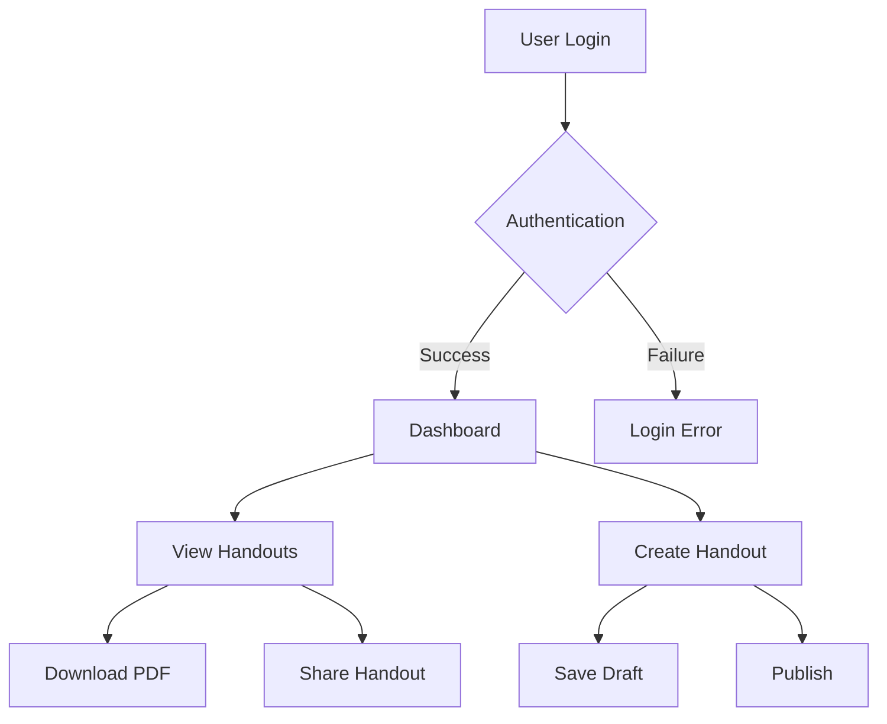
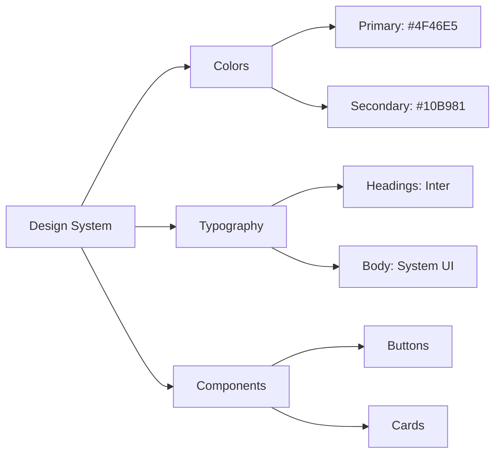

# Handout Project Overview

## 🎯 Project Vision
The Handout project is a modern web application designed to streamline the creation and management of educational handouts.

## 🔄 Main Workflow



The diagram above illustrates the core user journey through our application. Each box represents a key interaction point, and arrows show the possible paths users can take.

## 🌟 Key Features
- Interactive Dashboard
- PDF Generation
- Collaborative Editing
- Version Control

## 💡 Design Decisions & Discussion Points

### Visual Design


### Technical Stack
- Built with Next.js
- Tailwind CSS for styling
- SQLite database

## 🛠️ Development Setup

```bash
npm install
npm run dev
```

Open [http://localhost:3000](http://localhost:3000) with your browser to see the result.

## 📅 Next Steps
- Implement user feedback system
- Enhance PDF generation
- Add collaborative features

## 💬 Feedback & Contributions
Stakeholder feedback and suggestions are welcome through our issue tracking system.
