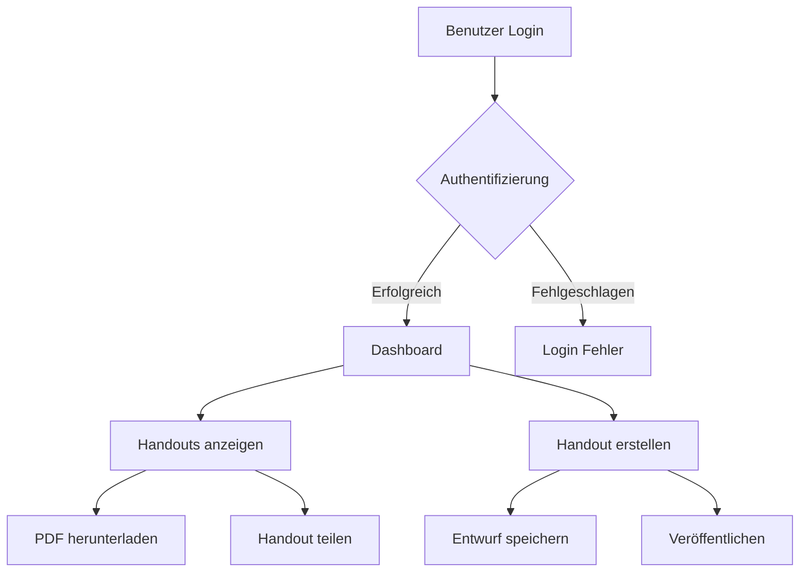
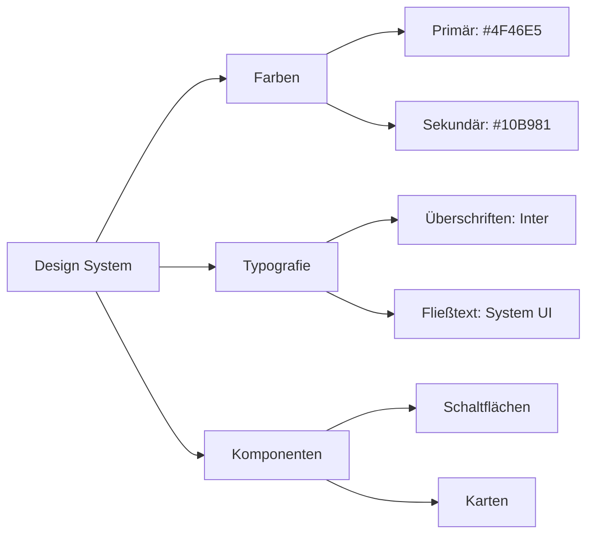

# Handout Projekt Übersicht

## 🎯 Projekt Vision
Das Handout-Projekt ist eine moderne Webanwendung zur vereinfachten Erstellung und Verwaltung von Unterrichtsmaterialien.

## 🔄 Hauptarbeitsablauf



Das obige Diagramm zeigt den Kernprozess der Benutzerführung durch unsere Anwendung. Jedes Kästchen stellt einen wichtigen Interaktionspunkt dar, und die Pfeile zeigen die möglichen Wege, die Benutzer nehmen können.

## 🌟 Hauptfunktionen
- Interaktives Dashboard
- PDF-Generierung
- Kollaboratives Bearbeiten
- Versionskontrolle

## 💡 Design-Entscheidungen & Diskussionspunkte

### Visuelles Design


### Technischer Stack
- Entwickelt mit Next.js
- Tailwind CSS für das Styling
- SQLite Datenbank

## 🛠️ Entwicklungsumgebung

```bash
npm install
npm run dev
```

Öffnen Sie [http://localhost:3000](http://localhost:3000) in Ihrem Browser, um das Ergebnis zu sehen.

## 📅 Nächste Schritte
- Implementierung eines Benutzer-Feedback-Systems
- Verbesserung der PDF-Generierung
- Hinzufügen von Kollaborationsfunktionen

## 💬 Feedback & Mitwirkung
Feedback und Vorschläge von Stakeholdern sind über unser Issue-Tracking-System willkommen.
